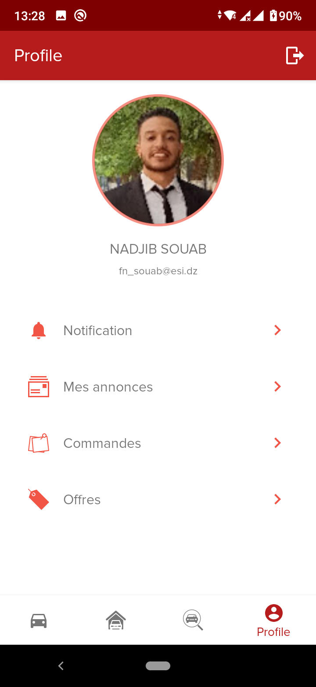
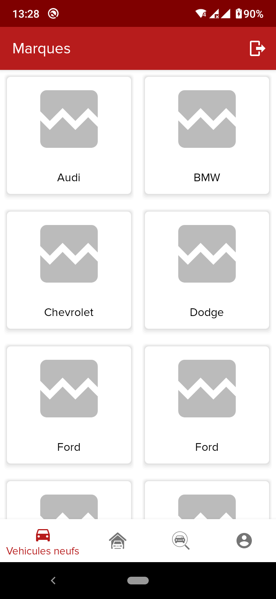
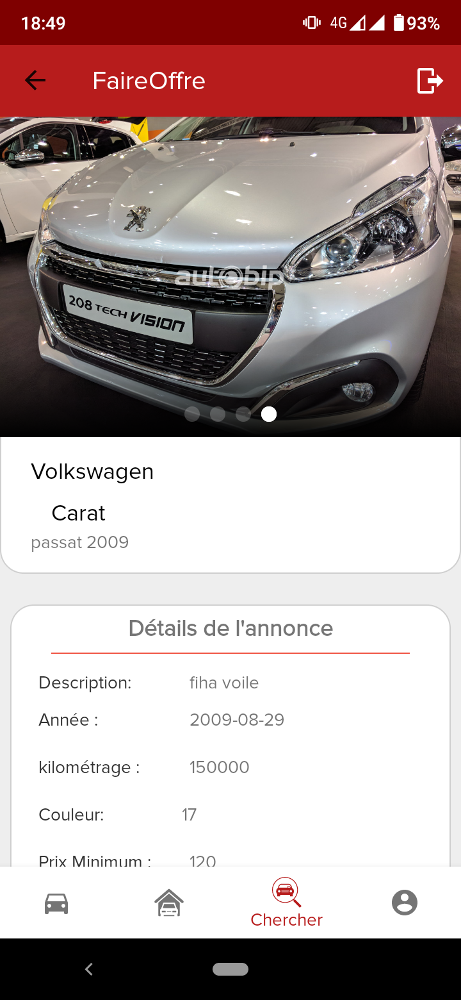
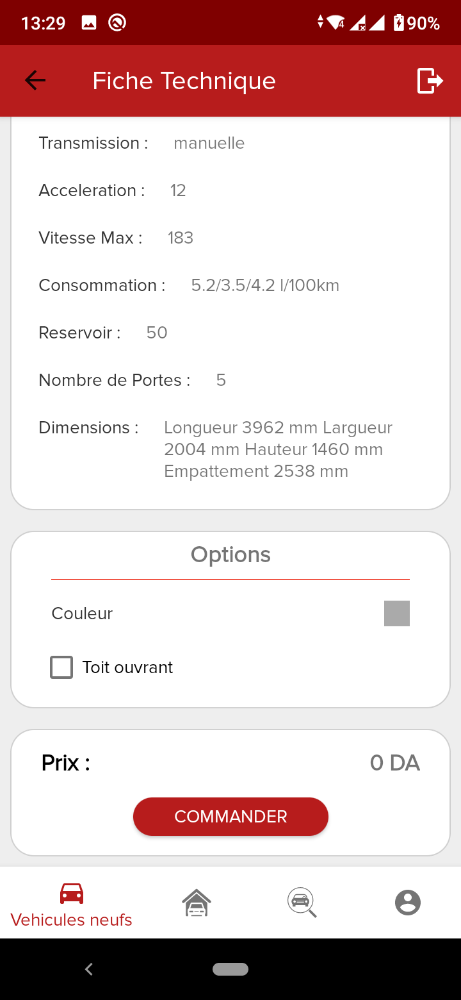
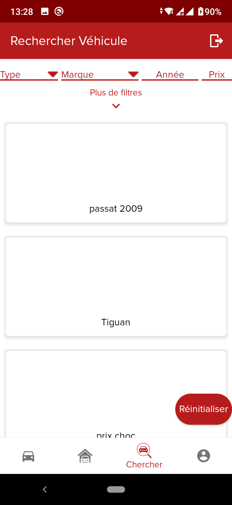

# Sayara-Dz
Sayara-Dz is an online digital marketplace for new / used vehicles. The project consiste of 3 Apps :

- **Backend App** : Manage users, permissions, vehicles stocks. Built with Django ([Repository](https://github.com/ChibahAbdelwahab/SayaraDz-EE-Backend))
- **Frontend App** : A dashboard for Admins, & vehicles contractors. Built with React.js ([Repository]())
- **Mobile App** : An Android App for the end user. Built with Android/Kotlin ([this repository](https://github.com/NadjibSb/SayaraDz-EE-Mobile))

## Sayara-Dz [Mobile App]

### Features
- Google / Facebook Login \
**New vehicles :**
- Display the list of new vehicles posted by contractors & listed by Brand / Model / Version  
- Display the caracteristique of the vehicle
- Dynamique pricing based on vehicle's options selection
- Order the vehicle \
**Used vehicles :**
- Display the list of used vehicles posted by end users
- Filtering based on brand/ model/ year/ price/ ...
- Display the caracteristique of the vehicle
- send a price offer to the seller

### Technologies
- Android with Kotlin
- Android jetpack's navigation
- MVVM architechture

### Demo

   
   
   \
   
   
   
  

